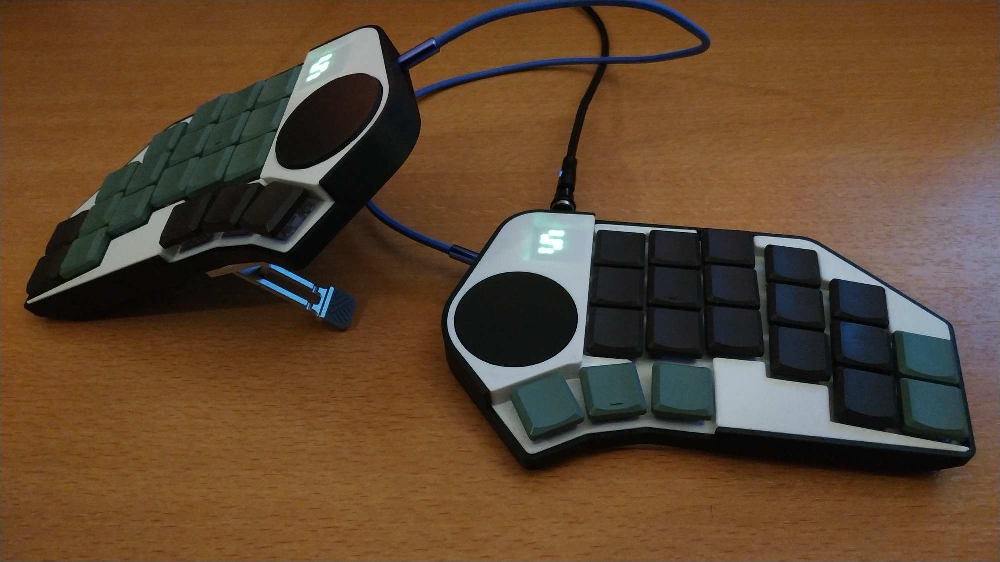
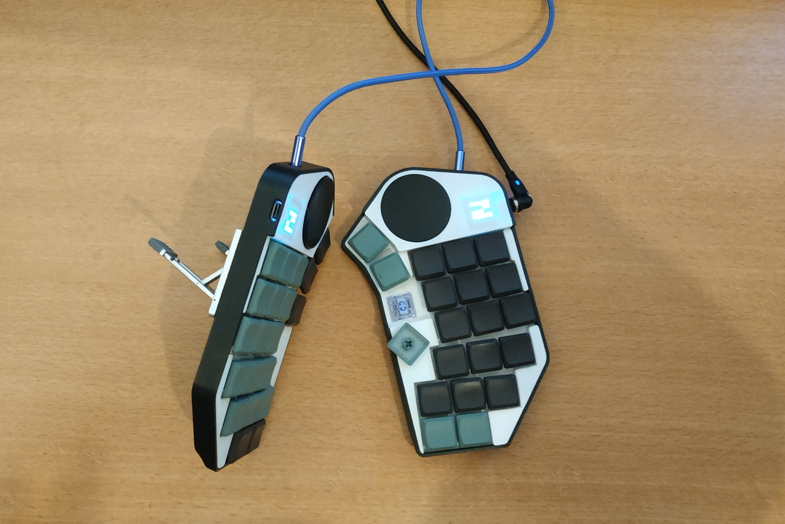
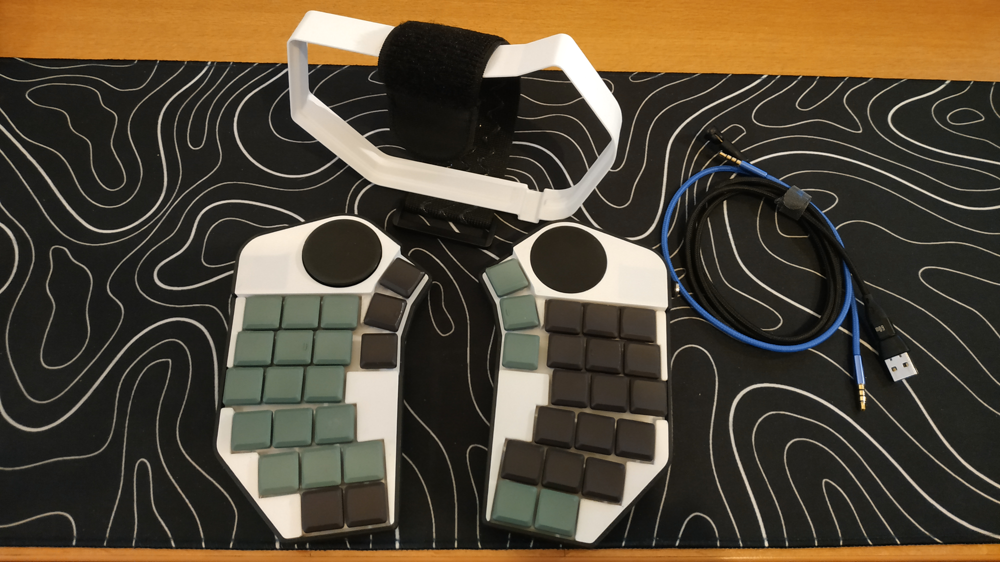
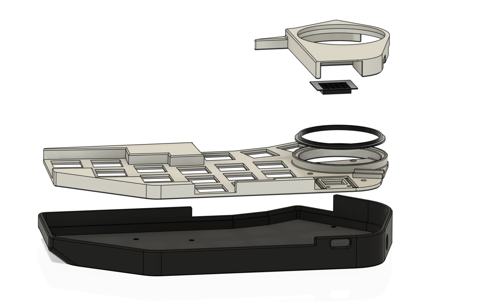
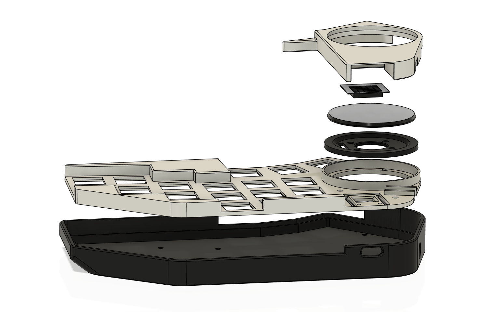
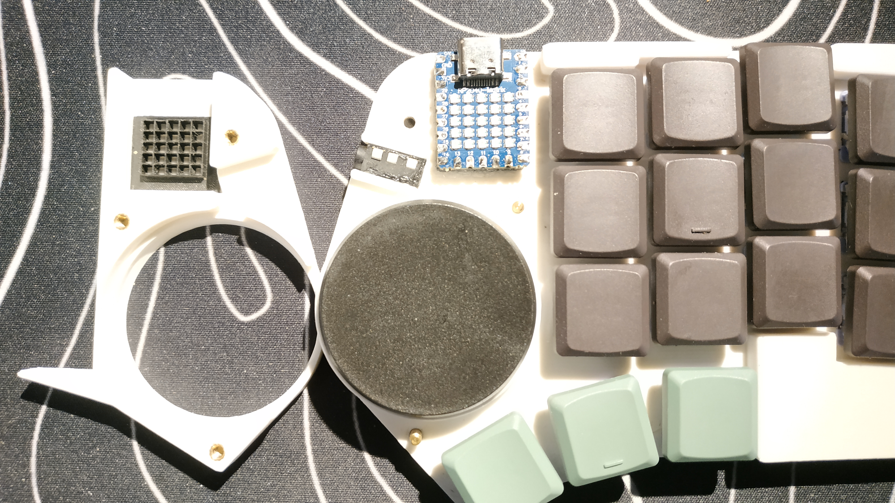

# Porg40
A 40 keys low-profile split keyboardo, handwired and 3d printed.

## Features

- Low profile design with GS-33 switches and Tai-Hao low-profile keycaps
- Led matrix layer display
- 40mm Cirque Trackpad (right side)
- 4-way switch (left side)

## Supplies

- 2x Waveshare RP2040 Matrix
- 40x Nuphy Wisteria switches
- 40x Tai-Hao MX low-profile keycaps
- 40mm Cirque Trackpad
- SMT adaptor and FPC cable for trackpad (12 pins)
- 5-way switch
- 44x ln4148 diodes
- TRRS connectors and cable
- M2.5 heat inserts
- M2.5 standoffs
- 1mm enamelled copper wire
- Folding legs for phone

## Build notes

### Printing

All the files are designed for the right side, don't forget to mirror them when printing the left side.
The plates are different wheither you are using the trackpad or the 5-way switch.

#### Side with Trackpad

From top to bottom
- Cover
- Led grid
- Trackpad support
- Plate
- case

#### Side with 5-way switch

From top to bottom:
- Cover
- Led grid
- DPad - NavSwitch keycap
- NavSwitch support
- Plate
- case|

### Assembly

The RP2040 is socketed with Mill-Max round pin header glued on the plate.
I used 1mm enamelled copper wire for the rows and columns and very thin enamel wire to connect to the pin header, I wrap them around the pin header and solder them.

The trackpad is connected to a SMT adaptor with a 12 pin FPC cable.

The TRRS connector is glued to the plate.
After finding the good orientation, the NavSwitch support is glued to the plate.

The led grid is glued to the cover, it must be aligned with the led matrix on the RP2040.

Place the heat inserts in the cover and the plate, the standoffs maintain the cover on the plate and the plate on the case.

## License

This work is licensed under a <a rel="license" href="http://creativecommons.org/licenses/by-nc-sa/4.0/">Creative Commons Attribution-NonCommercial-ShareAlike 4.0 International License</a>
